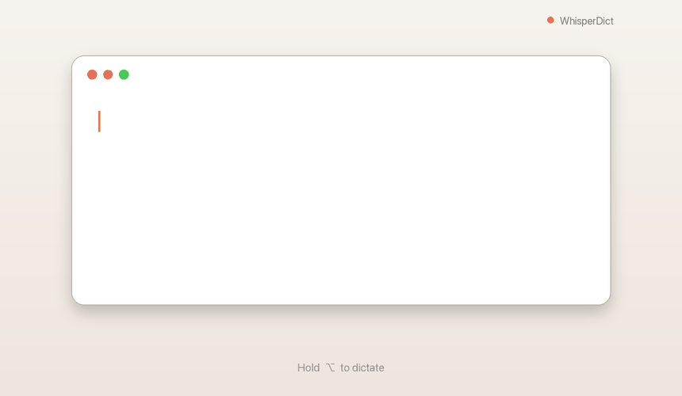

# Pith 🎙

[](https://github.com/sashabedard/Pith/actions/workflows/build.yml)


> **Talk instead of type.** Hold a key, say what you mean, release — your words
> appear as text in whatever app you're already in. 100% on-device.



## What's new in 1.0

- ✨ **Renamed to Pith** (formerly WhisperDict) — the pith of what you said.
- 🔏 **Signed & notarized by Apple** — installs and launches with no Gatekeeper
  warning, no workarounds.
- 🤖 **Bring your own model** — optionally route the cleanup step to any
  OpenAI-compatible endpoint: **local** (Ollama, LM Studio) or **cloud**
  (OpenRouter, OpenAI, Groq). Opt-in, off by default — the on-device Apple model
  stays the default. OpenRouter requests enforce **Zero Data Retention**, with
  cheap small-model presets built in.
- 🎨 New app icon and menu-bar glyph.
- 🍺 **One-line Homebrew install:** `brew install --cask sashabedard/pith/pith`.

See the full history on the [Releases](../../releases) page.

### Say it, don't write it

It's almost always easier to *describe* what you want out loud than to write it.
The moment you start typing, you stop — you second-guess a word, rewrite the
sentence, reread it to check it still makes sense, and somewhere in there the
original idea slips away.

**Speaking keeps the thought whole.** You say it once, the way you'd explain it
to a person, and it's down on the page before you can talk yourself out of it.

Pith turns that spoken stream into clean text right where your cursor is —
your editor, your chat, your prompt box, your notes. Hold **Right-Option**, think
out loud, release. Nothing leaves your Mac.

Powered by [WhisperKit](https://github.com/argmaxinc/WhisperKit) running OpenAI's
Whisper models locally via Core ML.

---

## Speak messy, paste clean

Real speech is full of "um"s, "you know"s, and false starts. Pith
**cleans it up as you go** — on-device — so what lands at your cursor reads like
you wrote it, not like you mumbled it:

```
You say:   "um so i uh basically want to like ship this feature today you know"

You get:   "So I basically want to ship this feature today."
```

Fillers gone, punctuation and capitalization fixed — and it **never leaves your
Mac**. Pick a style in Preferences:

- **Faithful** — clean only, keep your exact words *(default)*
- **Polished** — tighten and rephrase for clarity
- **Email** — rewrite in a professional tone

It will also *try* to resolve mid-sentence corrections ("no wait, I meant…") and
format spoken enumerations as bullet lists. These need real restructuring, which
is at the edge of what a small on-device model does reliably — so treat them as
**best-effort**, not guaranteed.

This runs on Apple's on-device model, so it needs **macOS 26 + Apple
Intelligence**. Without them, Pith simply pastes the raw transcript — the
feature switches off gracefully.

---

## Why people use it

- **Think out loud** — rough out a feature, a reply, or an idea by just talking.
  No blinking-cursor paralysis, no editing-while-you-draft.
- **Made for prompting AI** — long, rambling prompts are far faster *said* than
  typed. Brain-dump the whole context out loud and let the model tidy it up.
- **Stay in flow** — push-to-talk keeps you in the app you're already using.
  Zero context switch, zero window juggling.
- **Yours alone** — every word is transcribed on-device. No cloud, no account,
  no telemetry, nothing to leak.

## Features

- **Push-to-talk** — hold the **Right-Option** key to record, release to
  transcribe and auto-paste at the cursor.
- **On-device Whisper** — runs the `whisper-large-v3-turbo` model locally via
  WhisperKit + Core ML (no network calls, even on first run after the model
  downloads).
- **Smart cleanup (on-device AI)** — optionally polishes each transcript: drops
  "um/uh", fixes punctuation and capitalization, in Faithful, Polished, or Email
  style (and *best-effort* corrections/lists). Runs on Apple's on-device model —
  still 100% private.
  *(Requires macOS 26 + Apple Intelligence; off-by-default-gracefully otherwise.)*
- **Bring your own model (BYOK)** — prefer a stronger cleanup engine? Point the
  cleanup step at any **OpenAI-compatible** endpoint in Preferences → Enhance:
  a **local** server (Ollama, LM Studio — stays on your Mac) or a **cloud** one
  (OpenRouter, OpenAI, Groq). Opt-in and off by default; your API key is stored
  in the macOS Keychain, and OpenRouter requests enforce **Zero Data Retention**.
- **Menu-bar only** — no dock icon, stays out of your way.
- **History** — the last 8 transcriptions are kept; click one to re-paste it.
- **Configurable** — pick your language (defaults to French) and Whisper model
  in Preferences.

## Requirements

- macOS 13 (Ventura) or later
- Apple Silicon recommended (Core ML acceleration)
- **macOS 26 with Apple Intelligence recommended** — unlocks the on-device
  Smart cleanup. It's the experience Pith is built around, so turning it
  on (System Settings → Apple Intelligence) is worth it.
- On first launch, grant:
  - **Microphone** access (prompted automatically)
  - **Accessibility** access — System Settings → Privacy & Security →
    Accessibility (needed to synthesize ⌘V into other apps)
- *Optional:* **Smart cleanup** needs macOS 26 with **Apple Intelligence**
  enabled (System Settings → Apple Intelligence). Without it, dictation still
  works — Pith just pastes the raw transcript.

## Install

### Option A — Homebrew (recommended)

```bash
brew install --cask sashabedard/pith/pith
```

If Homebrew refuses with *"untrusted tap"*, run `brew trust sashabedard/pith` once, then re-run the install.

Pith is signed with a Developer ID and **notarized by Apple**, so it launches straight away — no Gatekeeper warning, no extra steps. Update with `brew upgrade --cask pith`. On first run, grant Microphone + Accessibility.

### Option B — Download

1. Download `Pith-<version>.dmg` from the [**Releases**](../../releases)
   page and open it.
2. Drag **Pith** into the **Applications** folder.
3. Launch it — it's notarized by Apple, so it opens normally and walks you
   through microphone + accessibility permissions.

### Option C — Build from source

```bash
git clone https://github.com/sashabedard/Pith.git
cd Pith
./Scripts/build.sh
open Pith.app
```

The first transcription downloads the Whisper model from the Hugging Face Hub
(one-time, a few hundred MB depending on the model).

All build and packaging tooling lives in [`Scripts/`](Scripts):

| Script | Purpose |
| --- | --- |
| `Scripts/build.sh` | Compile and assemble `Pith.app` |
| `Scripts/setup_signing.sh` | Create a stable self-signed identity (keeps TCC grants across rebuilds) |
| `Scripts/make_dmg.sh` | Package the app into a distributable `.dmg` |
| `Scripts/make_icon.py` · `make_dmg_bg.py` | Regenerate the app icon and DMG artwork |

## Usage

1. Launch Pith — its icon appears in the menu bar.
2. Click into any text field.
3. **Hold Right-Option**, speak, then **release**.
4. The transcribed text is pasted automatically.

### Updates & privacy

Pith checks for updates **only** when you click **Check for updates…** in
the menu, or if you turn on **Check for updates automatically** (off by default).
That check is a single public version lookup on GitHub — it sends **no data about
you**. When a newer release exists, the app downloads the `.dmg` to your Downloads
and reveals it in Finder; you install it the same way as the first time.
Everything else stays 100% on-device.

## License

**[GNU AGPLv3](LICENSE)** © 2026 Sasha Bédard.

Pith is free and open source. You may use, study, modify, and share it — but
**any distributed or network-hosted derivative must also be released as open
source under the AGPLv3** (including a hosted/SaaS version). This keeps Pith open
and prevents closed-source commercial forks. For a commercial license outside
these terms, contact the author.

Third-party components and their licenses are listed in
[THIRD-PARTY-NOTICES.md](THIRD-PARTY-NOTICES.md).
